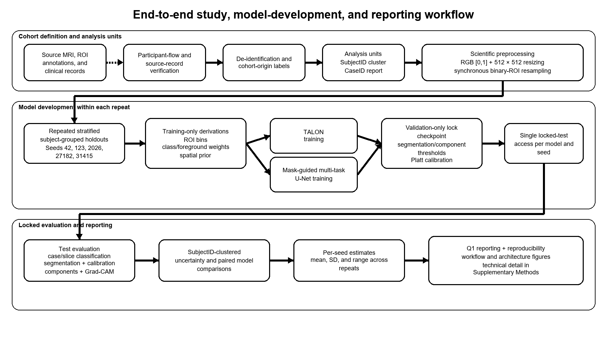
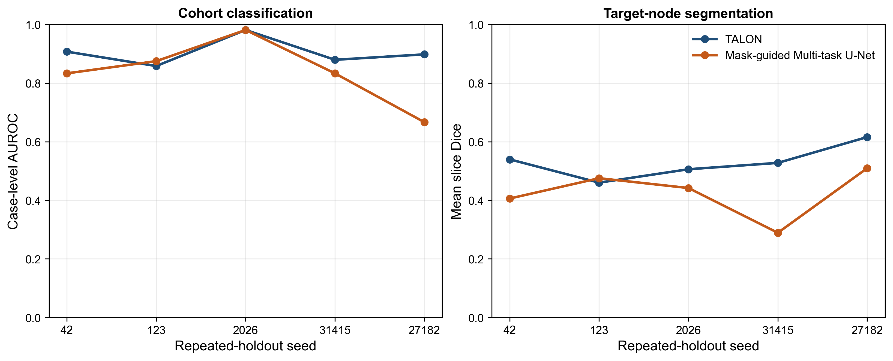

# TALON for InvBC–IGM axillary-node analysis on breast DCE-MRI

This repository contains analysis code, sanitized frozen results, and figure/table assets for a five-holdout comparison of **TALON** and a **Mask-guided Multi-task U-Net** for joint segmentation of a clinically preselected axillary target node and invasive breast cancer (InvBC)-versus-idiopathic granulomatous mastitis (IGM) source-cohort classification using two-dimensional raster slices from the contrast-series volume selected as the analysis reference in 3D Slicer. The holdouts were grouped by patient.

The frozen computational dataset represents 103 patients, 104 side-specific cases, and 1,367 axial slices.

> Public display name: **TALON**. The internal run identifier retained for traceability is `HYBRID_TALON`.



## Headline locked-test results

| Model | AUROC | AUPRC | Calibrated Brier | Dice | IoU |
|---|---:|---:|---:|---:|---:|
| TALON | 0.905 ± 0.047 | 0.892 ± 0.057 | 0.126 ± 0.032 | 0.530 ± 0.057 | 0.423 ± 0.050 |
| Mask-guided Multi-task U-Net | 0.838 ± 0.113 | 0.795 ± 0.154 | 0.175 ± 0.052 | 0.424 ± 0.085 | 0.327 ± 0.070 |

Values are mean ± SD across patient-grouped repeated holdouts with seeds 42, 123, 2026, 27182, and 31415. Each seed is one experimental unit; repeated appearances of a patient across holdouts are not pooled as independent observations.



## Repository map

- `src/talon_codex/`: preprocessing, models, losses, training, evaluation, statistics, component analysis, and XAI code.
- `src/talon_publication/hybrid_talon.py`: executed TALON architecture used in the paper.
- `configs/`: sanitized frozen scientific configuration and repeated-holdout design.
- `data/splits/`: deidentified patient-grouped split assignments (grouping key: `SubjectID`) and split audits.
- `results/`: sanitized per-seed and aggregate frozen outputs.
- `paper_outputs/`: main/supplementary figures, Draw.io architecture sources, tables, and figure source data.
- `notebooks/`: GitHub-renderable repository, architecture, result, and reproduction guides.
- `scripts/`: five-seed orchestration, evaluation/audit, and public figure/table regeneration.
- `docs/`: protocol, metric definitions, data governance, model cards, and limitations.

## Reproduce the public outputs

```bash
python -m venv .venv
# Windows: .venv\Scripts\activate
# Linux/macOS: source .venv/bin/activate
pip install -r requirements.txt
python scripts/reproduce_paper_outputs.py --output-dir reproduced
```

This route does not require clinical data. It regenerates the aggregate tables and five-seed performance figure from frozen CSV files.

## Full training and evaluation

Raw MRI, masks, clinical metadata, identity keys, prediction arrays, and checkpoints are not distributed. To rerun training:

1. Copy `configs/publication_config.example.json` to `configs/publication_config.local.json`.
2. Set `dataset_root` and `metadata_path` to institutionally authorized private locations.
3. Keep scientific hyperparameters unchanged for exact protocol reproduction.
4. Run the data/split audit before training.
5. Inspect `python scripts/run_repeated_holdout.py --help` or run individual stages with `scripts/run_publication_pipeline.py`.

The patient-grouping key is `SubjectID`; the reporting unit is side-specific `CaseID`, and segmentation metrics are calculated at the two-dimensional slice level. Bilateral right/left cases remain separate reporting cases but stay in the same patient group during splitting.

## Privacy and clinical-image warning

No raw MRI, raster masks, names, or re-identification keys are included. The repository contains two deidentified composite segmentation figures prepared for the manuscript. Details are provided in docs/DATA_GOVERNANCE.md.

## Reproducibility boundary

- Included: executed architecture and analysis code, frozen five-seed result tables, thresholds, curves, component-level outputs, teacher-checkpoint summaries, XAI summaries, and publication figures.
- Excluded: raw clinical data, underlying per-pixel arrays, model checkpoints, identity links, and unpublished manuscript DOCX files.


